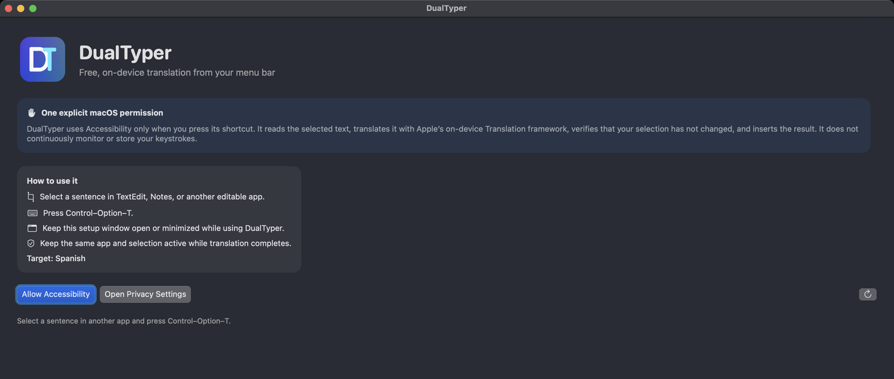

[](README.md) [](README.zh-CN.md)

# DualTyper

用于双语写作的 macOS 菜单栏翻译工具。在可编辑的应用中选中文本，按 **Control–Option–T**：DualTyper 保留原文，并在下方插入 Apple 设备端翻译结果。



## 环境要求

- Apple silicon 或 Intel Mac，运行 macOS 15+。
- 编辑控件通过 Accessibility 提供可读取、可替换的选区。
- 所选语言对的 Apple 翻译资源；首次使用时，macOS 可能提示下载。
- 用户有权打开身份不明开发者的应用，并授予辅助功能权限。

## 安装

下载 [v0.3.0 免费预发布版](https://github.com/zhuhroscar-tech/dualTyper/releases/tag/v0.3.0)，并核对发布的 SHA-256 校验和。普通用户无需安装 Xcode，也无需加入 Apple Developer Program。

1. 打开 `DualTyper-0.3.0-FREE-UNNOTARIZED.dmg`，将 DualTyper 拖入“应用程序”。
2. 尝试打开 `/Applications/DualTyper.app`。
3. 如被拦截，前往**系统设置 → 隐私与安全性 → 仍要打开**。如需认证，请在本机完成，切勿向他人提供密码。
4. 点击 **Allow Accessibility**，然后在**隐私与安全性 → 辅助功能**中启用 DualTyper。如列表中没有它，点击 **+** 添加该应用。
5. 更改权限后退出并重新打开 DualTyper。

免费版本采用 **ad-hoc 签名，未经 Apple 公证**。受组织管理的 Mac 可能禁止上述授权；请勿绕过管理员策略。更新后辅助功能权限可能失效，此时应移除旧条目，添加新应用并重新启用。校验和权限说明见[分发指南](docs/free-distribution.md)。

## 使用

在菜单栏选择目标语言。保持设置窗口**打开或最小化**，在支持的编辑器中选中一句话，按 **Control–Option–T**。翻译完成前不要切换应用或改变选区。

替换前，DualTyper 会再次核对进程、文本和选区范围；如有变化则取消插入。Accessibility 不支持跨进程的原子 compare-and-set，因此最终核对与写入之间仍存在很小的竞态窗口。

## 隐私与限制

- 不申请“输入监控”权限，不持续记录按键。所选文本仅在内存中交给 Apple Translation framework，不写入日志、不持久化，也不发送至项目运营的服务器。
- 拒绝安全输入模式及 `AXSecureTextField` 控件。
- 部分网页编辑器、Electron 应用、终端、游戏和远程桌面不提供可用的 Accessibility 选区。
- 这是快捷键触发的菜单栏应用，不是自动触发的键盘输入源。仓库保留了旧版 InputMethodKit 原型，但 ad-hoc 签名下的输入源注册并不可靠。

## 构建与测试

构建应用需要 Xcode 和 XcodeGen 2.46+。从以下命令开始：

```bash
xcodegen generate
swift test
./scripts/test-core.sh
./scripts/package-menubar-dmg.sh
```

打包脚本会构建并检查 universal app 和 DMG。应用生命周期、签名及打包校验说明见[架构文档](docs/architecture.md)和[分发指南](docs/free-distribution.md)。

[MIT 许可证](LICENSE)。
